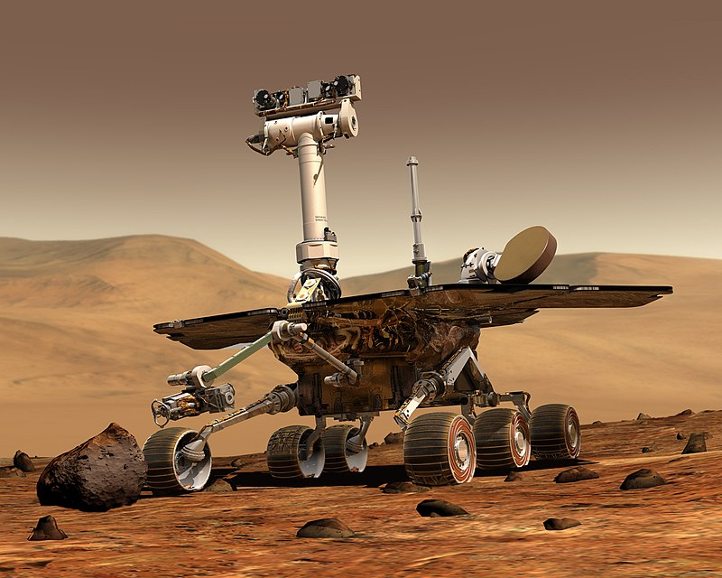

# Opportunity: autonomous driving car



## setup raspberry pi

### download and start a latest raspbian OS image

* [image](https://www.raspberrypi.org/downloads/raspbian/)
* [ssh](https://www.raspberrypi.org/documentation/remote-access/ssh/)
* [wifi](https://www.raspberrypi.org/forums/viewtopic.php?t=111100)

### upgrade your system packages

```bash
    sudo apt-get update
    sudo apt-get upgrade
```

### install necessary libraries

```bash
    sudo apt-get install python3
    sudo apt-get install xsel xclip libxml2-dev libxslt-dev libzmq-dev libspatialindex-dev virtualenv
```

### create a virtualenv

```bash
    virtualenv .env --python=python3
    source .env/bin/activate
```

### Pandas & Jupyter Requirements

```bash
    sudo apt-get install python3-lxml python3-h5py python3-numexpr python3-dateutil python3-tz python3-bs4 python3-xlrd python3-tables python3-sqlalchemy python3-xlsxwriter python3-httplib2 python3-zmq
```

### Scientific Python

```bash
    sudo apt-get install python3-numpy python3-matplotlib python3-scipy python3-pandas
```

### install Tensorflow

```bash
    sudo apt install libatlas-base-dev
    pip3 install tensorflow
```

### install opencv

```bash
    sudo apt-get install python-opencv
    pip3 install opencv-python
```

### install keras

```bash
    pip3 install keras
```

### install project

```bash
    git clone -b dev https://github.com/shijq23/donkeycar.git
    cd donkeycar
    pip3 install -e .[tf]
    #python3 scripts/setup.py
```

If see error: moviepy 1.0.0 has requirement imageio<2.5,>=2.0, but you'll have imageio 2.5.0 which is incompatible.

```bash
    pip3 install --upgrade setuptools
    pip3 install 'moviepy<1.0.0'
```

## train an auto pilot

### create a car app

```bash
    [pi]$ cd ~/donkeycar
    [pi]$ donkey createcar --path ~/mycar --overwrite
```

### drive and collect data

```[pi]$ python3 manager.py drive --model ~/mycar/models/linear.h5```

collect 10-20 laps of good data

### drive with joystick

```[pi]$ python3 manager.py drive --js --model ~/mycar/models/linear.h5```

### transfer data to PC

```[pc]$ rsync -r pi@<your_pi_ip_address>:~/mycar/tub/  ~/mycar/tub/```

### train a model

```[pc]$ python3 ~/mycar/manage.py train --type=linear --tub=<tub folder names comma separated> --model=~/mycar/models/mypilot```

### view tensorboard

```tensorboard --logdir=path/to/.tb_logs```

### transfer your pilot back to your car

```[pc]$ rsync -r ~/mycar/models/ pi@<your_ip_address>:~/mycar/models/```

### drive with your model

```[pi]$ python3 manage.py drive --model ~/mycar/models/mypilot```

### run donkey simulator client

```[pc]$ donkey_sim.x86_64```

### run donkey simulator server

```[pc]$ donkey sim --type=linear --config=~/mycar/config.py --model=~/mycar/models/sim```
